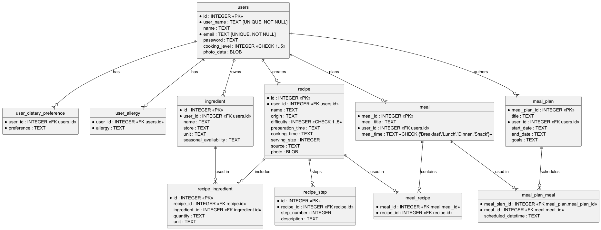

<div align="center">

# FoodBook

---

</div>

This project was created as an assignment for CS-372 Database Fundamental Course.
Food Book is a recipe and meal plan preparation app that will allow users to create recipes, build meals, make meal plans for different users.

This flask based application allows different users to create, update, access and delete recipes, meals and meal plans at the convinience. The app also supports user profiles, updates, views and delete of user profiles.

### [Live Demo link](https://www.loom.com/share/9dbf37e390b34bd5a8090aae0261113e?sid=a26fd182-9412-4645-9082-9faad1a5bf05)

---

## Table of Contents
 
- [Features](#features)  
- [Languages and Frameworks Used](#languages-and-frameworks-used)
- [Getting Started](#getting-started)  
  - [Prerequisites](#prerequisites)  
  - [Installation and Running](#installation-and-running)
- [Notes for Professor Johnson](#notes-for-professor-johnson)
- [Usage](#usage)
- [Citation](#citation)  
- [License](#license) 

---

## Features

- Feature 1: Authentication- Users can sign up and login via secured authentication system.
- Feature 2: Profile Management- Users can create, view, update and delete profile.  
- Feature 3: Deletion of user profile deletes all recipe, meals and meal plans related to user.  
- Feature 4: Users can create, read, update, delete recipes, ingredients, meals, meal plans.

---

## Languages and Frameworks used

---
### Front-end
1. HTML
2. CSS
3. Javascript
4. Bootstrap

### Back-end
1. Python
2. Flask
3. SQLite3

---

## Getting Started

### Prerequisites

- [Python 3.10+](https://www.python.org/downloads/)  
- [SQLite 3](https://www.sqlite.org/download.html) (or your preferred RDBMS)  
- (Optional) Virtual environment tool such as `venv` or `conda`

### Installation and Running

1. **Clone the repository**  
   ```bash
   git clone https://github.com/shamshertamang/CS372-DBFinalProject
   cd DB-FinalProject
2. **Create and activate a virtual environment**
    ```bash
    python3 -m venv venv
    source venv/bin/activate   # on macOS/Linux
    venv\Scripts\activate      # on Windows

3. **Install requirements**
    ```bash
   pip install -r requirements.txt 

4. **Running app**
    ```bash
   python main.py

5. **Access the application**
    Once the server is running, open your browser and navigate to:
    ```bash
   http://127.0.0.1:5000
    ``` 

---

## Project Structure

---

The project structure is as follows:

```text
foodbook/
├── ER-Diagrams/
│   ├── foodbook-data-dictionary.md
│   └── foodbook-erd.puml
├── instance/
│   └── database.db
├── website/
│   ├── __init__.py
│   ├── auth.py
│   ├── database.py
│   ├── models.py
│   ├── views.py
│   ├── sql/
│   │   ├── ddl.sql
│   │   ├── dml.sql
│   │   └── queries.sql
│   ├── static/
│   │   └── images/
│   │       ├── default-profile.png
│   │       └── default-recipe.png
│   └── templates/
│       ├── add_meal.html
│       ├── add_meal_plan.html
│       ├── add_recipe.html
│       ├── base.html
│       ├── edit_meal.html
│       ├── edit_meal_plan.html
│       ├── edit_recipe.html
│       ├── home.html
│       ├── login.html
│       ├── profile.html
│       ├── sign_up.html
│       ├── view_meal.html
│       ├── view_meal_plan.html
│       └── view_recipe.html
├── LICENSE
├── main.py
├── proposal.md
├── README.md
└── requirements.txt
```

---

## API Endpoint Documentation

---

API Endpoint documentation can be found in the root directory under API_ENDPOINTS.md.

---

## Plant UML Schema Diagram

---



---

## Notes for Professor

---

This app has disabled password hashing to allow for using dml data for test. The database will initialise four users, you can login with their credentials which are as follows:
1) email: aarav@example.com password: hashedpassword1
2) email: emily@example.com password: hashedpassword2
3) email: carlos@example.com password: hashedpassword3
4) email: bella@example.com password: hashedpassword4

I suggest you to use the first credentials for checking this assignment because it has more data concerning ingredients, recipes, meals and meal plans. You may check out other credentials too if you want.

If you wish to sign up/login yourself, you are more than welcome to do so. Just keep in mind that you will need to populate recipes, ingredients, meals and meal plans by yourself.

ddl.sql, dml.sql and queries.sql are placed in website/sql, if you want to view them.

Go to usage for further instructions on using the application.

---

## Usage

---

To use the app, you need to sign up/log in. You will have access to home page where you can create recipes, meals and meal plans. 

Home page features a view button and a delete button for these recipes, meals and meal plans that are created. 

The view button will lead you to view the recipe/meal/meal plan which all have different details depending on which you are viewing. The view pages have edit feature which allows you to edit the recipe/meal/meal plans. 

You can use the profile page by clicking on the profile button on the menu bar where you can view, edit or delete your profile.

You can log out the app, using logout button in the menu bar.


Create recipe in the home page, you can delete recipe or view edit. View Recipe as 
raw sql location
ddl and dml and queries

---

## Future Improvement Opportunities

---

The application currently doesn't support ingredient page and direct CRUD with ingredients, but use recipe to do CRUD with ingredients. Ingredients could have a separate page to CRUD.

While the recipe table in the database supports image, the front end and the backend currently do not process it. Recipe image can be integrated to recipe, meal and meal plan pages.

A social network can be made among users with recipe sharing features.

AI APIs can be connected to produce AI generated recipes.

User can be alerted with recipes that have allergies.

More interactive front end can definitely play a part in the improvement.

--- 

## Citation

---

[TechwithTim's flask tutorial](https://github.com/techwithtim/Flask-Web-App-Tutorial?tab=readme-ov-file) was used to get started with flask, especially the authentication and base html. On top of that, AI was used extensively to create front end with html, css, js.

---

## License

---

The project is licensed by MIT license which can be viewed in this repository.
